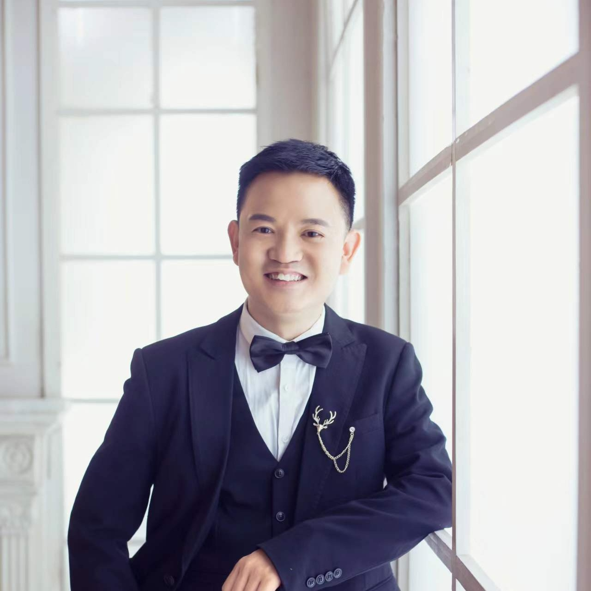

# Bio

Hi! I am a computer vision researcher with B.E. mathmatics at Northwestern Polytechnical University from Xi'an, China.

I just left from Xi'an GraphLight Intelligent Technology Co., Ltd. at 2024.3. Previously I led a computer vision team at a startup company which aims to develop (subway) Rail Inspection Vehicles since 2020.6 to 2023.11.

I obtained my Bachelor's degree from the Mathematics Department at the University of Northwestern Polytechnical (NPU) in Xi'an, China, in June 2007. After that, I pursued my postgraduate studies starting from September 2008 and became a PhD student in the School of Mechanical Engineering at NPU in September 2010. I completed my studies at NPU in December 2019. During my time there, I had three papers published, one in Chinese and two in English.

Now I am living in Xi'an City of China and i 'm looking for remote jobs.

# Research Interest

Visual Attention, Saliency Prediction, eye tracking

# Publications

1. A Bioinspired Visual Saliency Model, Ke Zhang, Xinbo Zhao and Rong Mo, JNWPU, 37 3 (2019) 503-508, DOI: https://doi.org/10.1051/jnwpu/20193730503

2. Zhang, K., Zhao, X., Mo, R. (2018). Bottom-Up Saliency Prediction by Simulating End-Stopping with Log-Gabor. In: , et al. Advances in Brain Inspired Cognitive Systems. BICS 2018. Lecture Notes in Computer Science(), vol 10989. Springer, Cham. https://doi.org/10.1007/978-3-030-00563-4_44

3. K. Zhang, X. Zhao, Z. Ma and Y. Man, "A Simplified 3D Gaze Tracking Technology with Stereo Vision," 2010 International Conference on Optoelectronics and Image Processing, 2010, pp. 131-134, doi: 10.1109/ICOIP.2010.346.

# Education

Northwestern Polytechnic University, Doctor of Philosophy (PhD), 2011-2019
Northwestern Polytechnic University, Master of Engineering (MEng), 2008-2010
Northwestern Polytechnic University, Bachelor of Science (BS), 2002-2007

> To a great mind, nothing is little

# Work experience

## Xi'an GraphLight Intelligent Technology Co., Ltd. - Xi'an  2023.12 - 2024.3 
senior computer vision engineer
    research and develop solutions of  filling holes  in point cloud
    develop 2D face detection+3D face recognition pipeline
    investigate and implement other preprocessing algorithms such as outlier removing

## Xi'an Huoyan Intelligent Inspection Research Institute - Xi'an, CN  2020.6 - 2023.11 
Senior Computer Vision Engineer
Researched, developed and implemented creative computer vision algorithms with MATLAB, C++, python including:
    component detection in tunnel(YOLOV5-V8)
    anomaly object detection on railway surface(POOLNET, SOLO)
    leakage/spalling detection and segmentation(YOLOV5-V8)
    crack segmentation(deeplabV3+, unet++, sa-unet, transunet).
    Invented an anti-counterfeiting label based on QR code and embedded anti-counterfeiting curvesUtility Patent
    authorized by CNIPA, designed and developed the counterfeiting detection algorithm with cellphone cameras.

## Skills
Opencv· Pytorch · TensorFlow · Caffe · Python · C++ 
